# Finding evidence of cheating in MLB broadcast audio


## TL;DR.
I created a model to see if I could find any link between the type of pitch thrown and the sounds that precede the pitch. Under the assumption of no cheating, a well-generalized fitted model would find no link. However, in the case of the Astros 2017 season, the banging of a trash can was used to relay to the batter that an off-speed pitch was coming. This begged the question, if a model can identify that an off-speed pitch correlates with a trash can bang in the audio, can we identify random audio-based cheating with no prior knowledge? The results from this analysis shows that in the case of the blatant Astros cheating scheme, yes we can.


## Preface
**background** https://en.wikipedia.org/wiki/Houston_Astros_sign_stealing_scandal


Data and statistics in baseball has always been a central part of the sport. Every move of the ball and action from the players are tracked, tabulated, and compared against. With so much data available, and especially now with the introduction of MLB Statcast a few years ago, fan-based baseball analysis is everywhere.
After the Astros cheating scandal came out, tons of articles were published analyzing the effect of the cheating on their World Series win. These were all super interesting reads but what I was interested in was how, if possible, could we have identified the cheating itself and not just evidence from its result?

What struck me the most while watching the Astros sign stealing cheating scandal unfold *nearly a year after the cheating occurred* was how blatantly obvious the sign stealing came through in the TV broadcasts. The banging sounds were so clear it almost seemed like the can was mic'd up itself. I suppose in a world of instant tabulation of newer and newer sabermetrics, the sounds and buzz of the stadium are still sacred. 

Given how clear the banging sound was in the broadcast audio, it seems reasonable that a model can accurately identify the trash can banging sounds. The more interesting question to me is could this be used to flag cheating without prior knowledge that cheating is going on?


# Results
[](https://www.youtube.com/watch?v=wWOyXkG35tk)

The model identified 785 instances of trash can banging. I've created a youtube video (https://youtu.be/wWOyXkG35tk) that includes all bang sounds that the model identified(Note: the model also sometimes identified sounds that sounded like bangs but were not).

I've also validated it against Tony Adams manually tagged data from his website, http://signstealingscandal.com/.

|   | Bang(Manual)  |No Bang(Manual)    | Not Tagged(Manual)
|---|---|---|---|
| Bang(Model)  | 550  |69   | 173
| No Bang(Model)  |  590 | 6757  | 2912
| Not Tagged(Model)|2 |306 |N/A

In other words, of the overlap between the manual tagging and the model:
- the model was able to identify just under half(48.2%) of the actual bangs
- it correctly identified 99% of the non-bangs 


A lot of things had to go right in order for the model to learn in this case:

- the trash can was either near a broadcast microphone or was extremely loud.
- The Astros did not switch up their bang signal game-to-game(bang always meant off-speed).
- They did this for full season of data giving us thousands of data points.
- They used the same trash can which gives us an almost identical noises each time.

**Two caveats that may not indicate cheating:**
- the announcers may say the pitch type out load if they are aware of whats coming next
- the model may learn from the presence of a bat sound if a player is more succesful with a certain type of pitch. This should be accounted for when validating the results.


When plotting a histogram of the predictions we see a clear clustering of a small percentage of pitches with high value predictions.

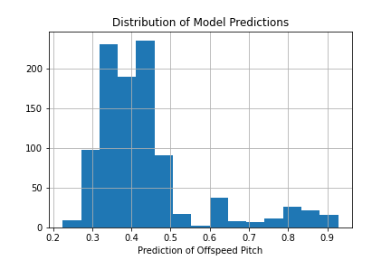

The "bang" is seen in all of these audio spectrograms as the triangular shape at the bottom of each image. Some have more than 1 bang.
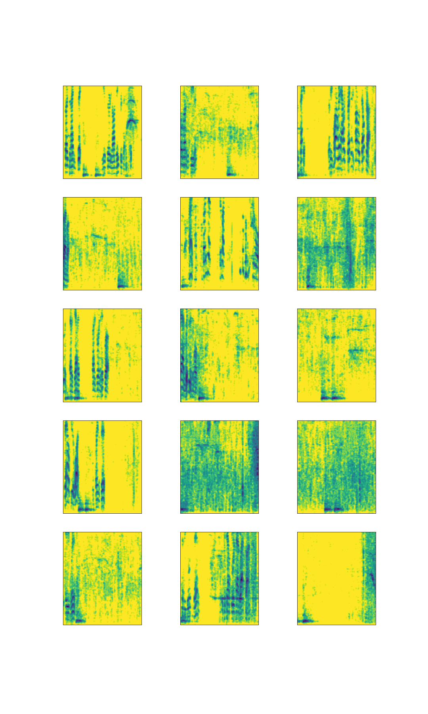


[MLB Video Playlist of Top 5 Predictions](https://www.mlb.com/video/00u7yc7ivV9ndZQst356/reels/highest-offspeed-predictions)


# Project Outline
- Data Preparation
  - Video Data
    - Scrape MLB.com for at-bat videos
    - Strip out audio from video clips
    - denoise the audio
    - Generate mel-spectrograms images
  - Meta Data
    - Scrape MLB.com for pitch metadata
    - one-hot encode batters
    - create the target by binarizing off-speed and fastball pitches to 0-1
- Model Training
  - Split dataset into training and test datasets
  - Fit C-NN and optimize hyperparameters
- Model Inference and Analysis
  - Inspect the prediction distribution to determine if cheating signals are present
  - Use SHAPley values to pinpoint the sound itself
- Future Work
  - Rerun the analysis for past seasons and other teams

## The Data

### Meta Data
The data was scraped from the MLB baseball savant website https://baseballsavant.mlb.com/statcast_search using Beautiful Soup. I pulled all pitches thrown to Astros batters in home games during the 2017 seasons.

**add more charts here with ground truth data**

- 12,642 total pitches
- 19 players
- 45.4% of pitches were off-speed 

| batter          | percent off-speed | total |
|-----------------|-----------|-------|
| George Springer | 43.5%    | 1382  |
| Jose Altuve     | 49.1%    | 1313  |
| Alex Bregman    | 43.4%    | 1248  |
| Marwin Gonzalez | 52.1%    | 1223  |
| Josh Reddick    | 42.0%    | 1094  |
| Yuli Gurriel    | 46.3%    | 1062  |
| Carlos Beltrán  | 43.7%    | 996   |
| Carlos Correa   | 45.6%    | 961   |
| Brian McCann    | 46.5%    | 871   |
| Evan Gattis     | 53.6%    | 683   |
| Jake Marisnick  | 39.9%    | 486   |
| Norichika Aoki  | 40.2%    | 378   |
| Derek Fisher    | 40.3%    | 347   |
| Tyler White     | 43.9%    | 132   |
| Juan Centeno    | 33.3%    | 123   |
| J.D. Davis      | 42.0%    | 112   |
| Cameron Maybin  | 41.2%    | 97    |
| Tony Kemp       | 25.5%    | 55    |
| Max Stassi      | 36.5%    | 52    |
| AJ Reed         | 44.4%    | 27    |

Three example rows in the table:

| pitch | pitcher          | batter           | count | date     | dist | exit_velocty | inning | launch_angle | mph  | pitch_id                             | pitch_result | spin_rate | zone |
|-------|------------------|------------------|-------|----------|------|--------------|--------|--------------|------|--------------------------------------|--------------|-----------|------|
| SL    | Kershaw, Clayton | Springer, George | 2-Mar | 10/29/17 | NaN  | NaN          | Bot 5  | NaN          | 88   | 27df5d03-0f01-495b-8528-b8a277c30c2b | ball         | 2613      | 13   |
| FF    | Kershaw, Clayton | Springer, George | 2-Mar | 10/29/17 | 222  | 100.7        | Bot 5  | 14           | 93.2 | 1dd2e806-8a45-4433-a7fa-64b637537161 | foul         | 2345      | 4    |
| SL    | Kershaw, Clayton | Springer, George | 2-Mar | 10/29/17 | 259  | 85.4         | Bot 5  | 40           | 89.1 | ef5299e9-c8af-4c49-bf89-0611c311e6f6 | foul         | 2578      | 9    |

### Video Data
The pitch_id from the metadata then used to download the actual video file for that pitch using `wget`. For example, the first pitch in the table can be downloaded here:
https://sporty-clips.mlb.com/27df5d03-0f01-495b-8528-b8a277c30c2b.mp4

From this video file, I then extracted the audio using `ffmpeg`, denoised the audio with `noise_reduce` and then converted to a mel-spectrogram using `librosa`.
Below are afew examples of the outputed spectrograms.

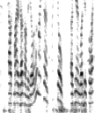
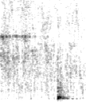
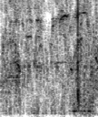

## Model Architecture

The model consists of two combined components:
1. image data goes through through 3 convolutional layers and a dense layer on its output
2. meta data goes through a single 4 node dense layer

Both of these layers are then concatenated and outputed to a second 32 node dense layer before finally outputing to a sigmoid function.

```
class BaseballCNN(nn.Module):
    def __init__(self,filters=32,dropout=0.1,nodes=32):
        super().__init__()
        self.conv1 = nn.Conv2d(1, filters, 3)
        self.pool1 = nn.MaxPool2d(2)
        self.drop1 = nn.Dropout(p=dropout)
        
        self.conv2 = nn.Conv2d(filters, filters, 3)
        self.pool2 = nn.MaxPool2d(2)
        self.drop2 = nn.Dropout(p=dropout)
        
        self.conv3 = nn.Conv2d(filters, filters, 3)
        self.pool3 = nn.MaxPool2d(2)
        
        self.linear_image = nn.Linear(filters* 11* 14,nodes-4)
        self.linear_meta = nn.Linear(20,4)
        self.drop3 = nn.Dropout(dropout)
        
        self.linear2 = nn.Linear(nodes,nodes) 
        self.drop4 = nn.Dropout(dropout)
        self.linear3 = nn.Linear(nodes,1)
        
    def forward(self, x_image,x_meta):
        
        # 3 convolutional layers on the image with max pooling
        x_image = F.relu(self.conv1(x_image))
        x_image = self.pool1(x_image)
        x_image = self.drop1(x_image)
        x_image = F.relu(self.conv2(x_image))
        x_image = self.pool2(x_image)
        x_image = self.drop2(x_image)
        x_image = F.relu(self.conv3(x_image))
        x_image = self.pool3(x_image)
        x_image = torch.flatten(x_image,1)

        # a dense layer with 4 nodes for the meta data
        x_image = self.linear_image(x_image)

        # a dense layer on the flattened image layers
        x_meta = self.linear_meta(x_meta)

        # concatenating the two dense components 
        x = torch.cat((x_image,x_meta),1)

        # sigmoid output
        x= torch.sigmoid(self.linear3(self.drop4(self.linear2(x))))
        return x
```


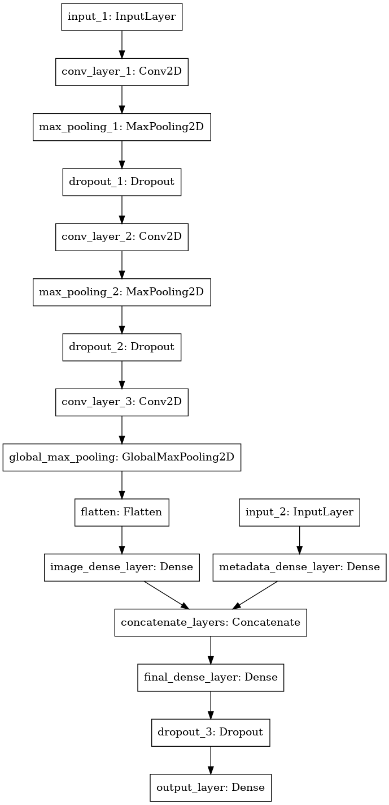

Interestingly, the model starts to truly fit to the data after ~16 epochs and continues to decrease loss on the validation set until epoch ~30. Early stopping was applied to ultimately select the weights after 31 epochs.

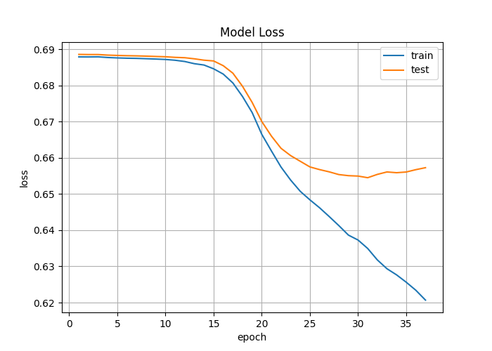

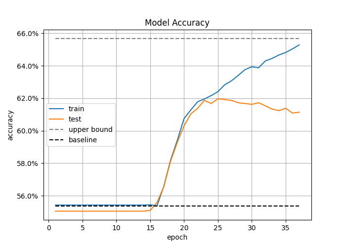

## SHAP Interpretation of the Predictions

I then ran SHAP DeepExplainer on the predictions and plotted out where within the image the prediction was derived from.
- the blue line shows the magnitude of the contribution towards the model score was within that point in time in the clip
- the red spots are the exact spots that the shapley values were higher within the image
- the black background is the original image spectrogram
- the grey box shows the area that was selected for the final youtube video output clip(centered around the maximum point on the blue line)

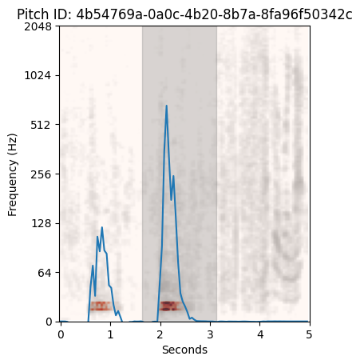
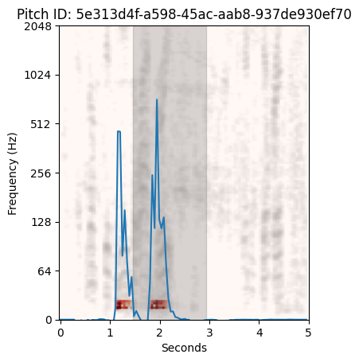
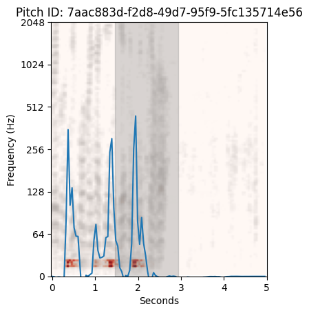
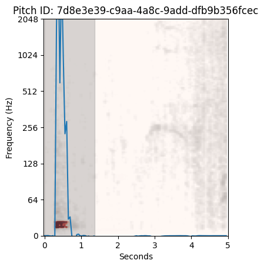
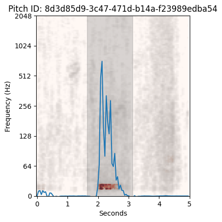
